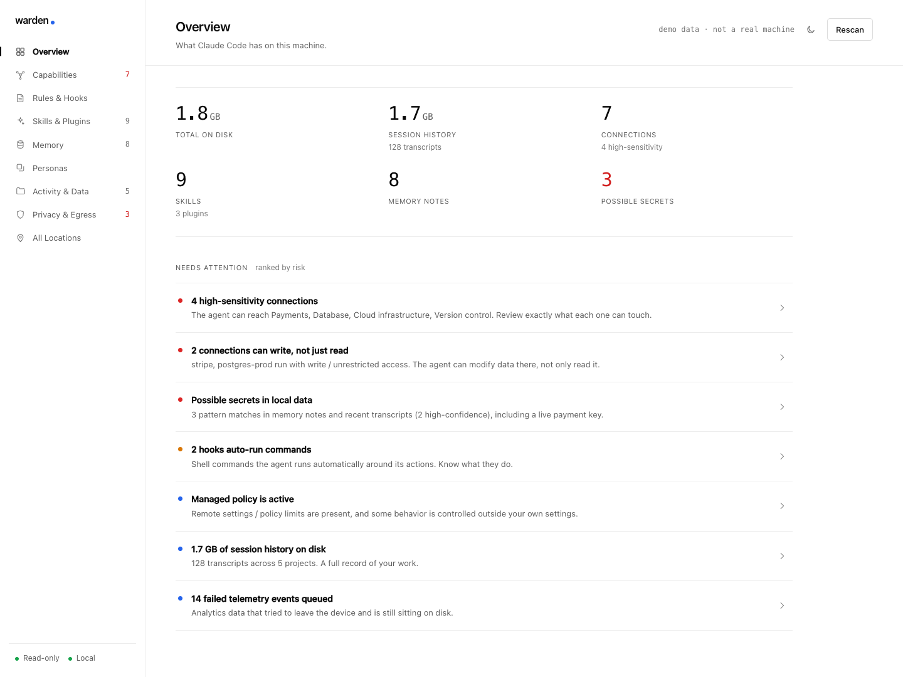
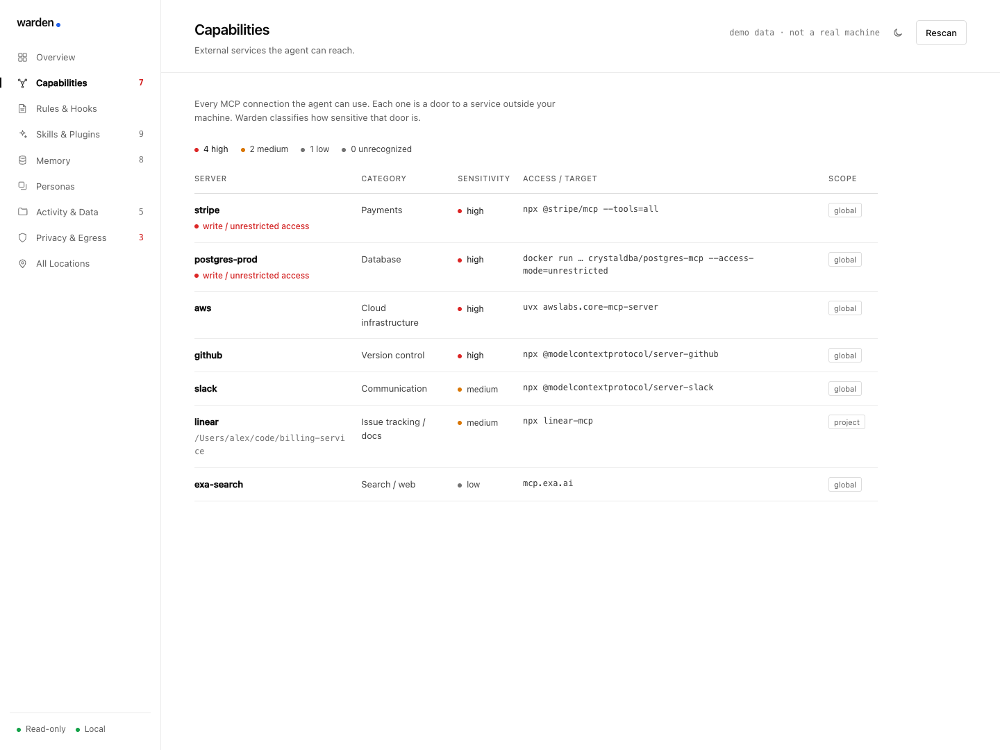
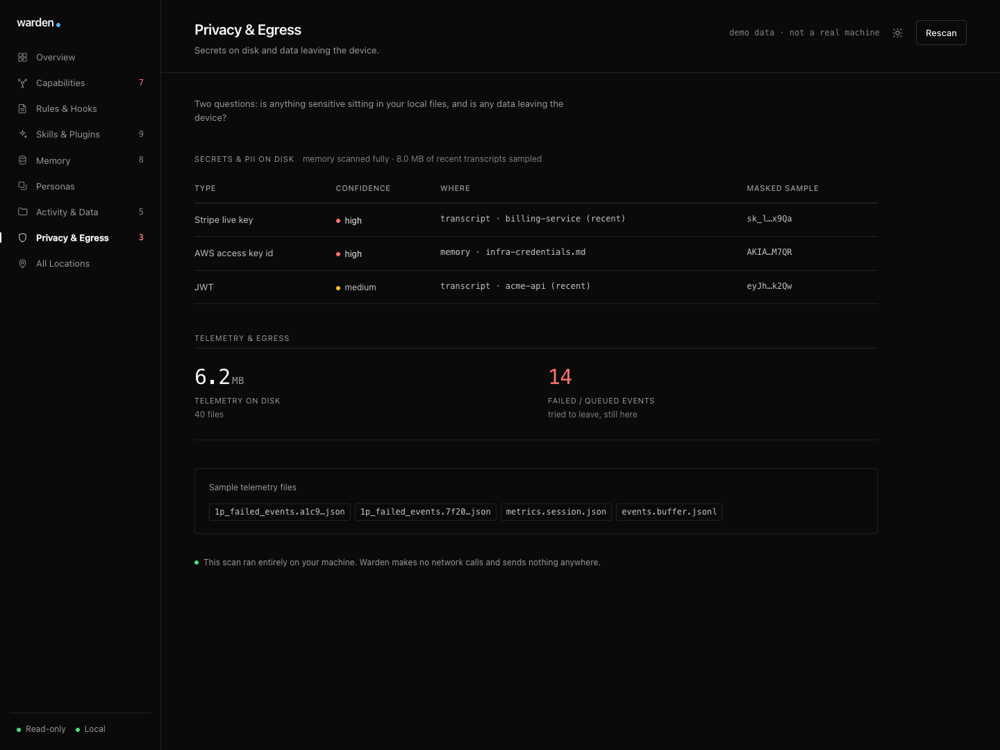

# warden

**See and control everything Claude Code keeps on your machine.** Config, MCP connections, rules, hooks, skills, memory, and session history, in one local dashboard. Read-only by default, and nothing ever leaves your device.

<picture>
  <source media="(prefers-color-scheme: dark)" srcset="docs/assets/overview-dark.png">
  
</picture>

<p align="center"><em>Screens show demo data (a fictional machine). Run <code>npm start -- --demo</code> to explore it yourself.</em></p>

> Working name. This release (Phase 1) is visibility. The roadmap below turns it into a control and governance layer.

---

## The problem

Claude Code is powerful, but everything it stores is scattered across deep, undocumented folders: `~/.claude.json`, `~/.claude/`, per-project memory notes, telemetry, backups. A technical person can dig through it. Almost nobody does. So most people have no real answer to a simple question:

**What can this agent see, do, remember, and send from my machine?**

warden answers that in one screen, and ranks what actually needs your attention.

## What it surfaces

warden reads the scattered places Claude Code writes to and turns them into a risk-ranked picture. On the demo machine above it immediately flags that the agent can reach **Payments, a production database, and cloud infrastructure**, that two of those connections can **write, not just read**, and that a **live payment key** is sitting in a session transcript.

### Capabilities: every door the agent can open

Each MCP connection is classified by how sensitive it is, and flagged when it can write rather than just read.

<picture>
  <source media="(prefers-color-scheme: dark)" srcset="docs/assets/capabilities-dark.png">
  
</picture>

### Privacy & egress: what is exposed, and what is leaving

Secret and PII patterns found in local files and recent transcripts (always masked), plus the telemetry sitting on disk.



### The rest

- **Overview** — a risk-ranked feed of what needs your attention, computed from everything below.
- **Rules & Hooks** — your global CLAUDE.md, permissions, and any shell commands that run automatically. Plus per-project trust and permission state.
- **Skills & Plugins** — the installed abilities the agent can invoke.
- **Memory** — everything the agent has written down about you, across projects.
- **Personas** — how your scattered config maps onto switchable per-context bundles (preview).
- **Activity & Data** — session history and its footprint on disk, so you can see it and, with Controls on, reclaim it.
- **All Locations** — a plain-English map of every place Claude Code stores something.

## Quickstart

Requires Node.js 18 or newer. There are **no dependencies to install**.

```bash
git clone <your-repo-url> warden
cd warden
npm start
```

warden starts a local server on `127.0.0.1:4317` and opens it in your browser. That is it.

```bash
npm start -- --demo      # explore a fictional machine, without touching your own
node bin/warden.js --port 4400   # choose a port
node bin/warden.js --no-open      # do not auto-open the browser
```

## Privacy and trust

This is a tool about trust, so it is built to earn it:

- **Read-only by default.** warden reads and changes nothing until you explicitly turn on Controls. Even then it never hard-deletes your live data: forget and archive *move* files into a local trash (`~/.claude/.warden-trash`) recorded in a manifest, and anything can be restored to exactly where it was. The one permanent delete is emptying that trash, which is never automatic, always confirmed by you, and can only ever remove what is already inside the trash. Every path is validated to stay inside `~/.claude`.
- **100% local.** It makes zero network calls. Nothing is uploaded, tracked, or phoned home.
- **Zero dependencies.** The entire tool is plain Node.js and vanilla web files. No supply chain to trust.
- **Secrets stay masked.** When warden detects a key or token, it shows a masked sample so you can locate it, never the full value.
- **Loopback only.** The server binds to localhost and rejects non-local requests.

Read the source. It is small on purpose.

## How it works

A read-only scanner (`src/scanner/`) reads the known Claude Code locations, classifies MCP connections by sensitivity, scans memory notes and a bounded sample of recent transcripts for secret patterns, and assembles one JSON model. A tiny zero-dependency server (`src/server.js`) serves that model to a vanilla dashboard (`src/ui/`). The map of where everything lives and what it means is in `src/scanner/paths.js`, and the demo dataset is `src/scanner/demo.js`.

## Roadmap

warden ships as a visibility tool. The direction is a control and governance layer for AI agents.

- **Phase 1, Visibility (this release).** See everything, safely, read-only.
- **Phase 2, Control (in progress).** Opt-in, reversible writes. Shipped: forget and restore memory notes; archive, restore, and reclaim session-transcript disk space. Next: edit rules and permissions, toggle connections, switch and edit personas.
- **Phase 3, Governance.** A tamper-evident activity log, guardrails as policy, secret and PII scanning at scale, cost visibility, and persona sync across a team.
- **Phase 4, Cross-agent.** One control plane for every local AI agent, not just Claude Code.

## Status

Early and honest about it. Phase 1 works and is useful today. The scanner is defensive and degrades gracefully when files are missing, but the Claude Code config format changes over time, so expect the occasional gap. Issues and PRs welcome.

## License

MIT. See [LICENSE](LICENSE).
